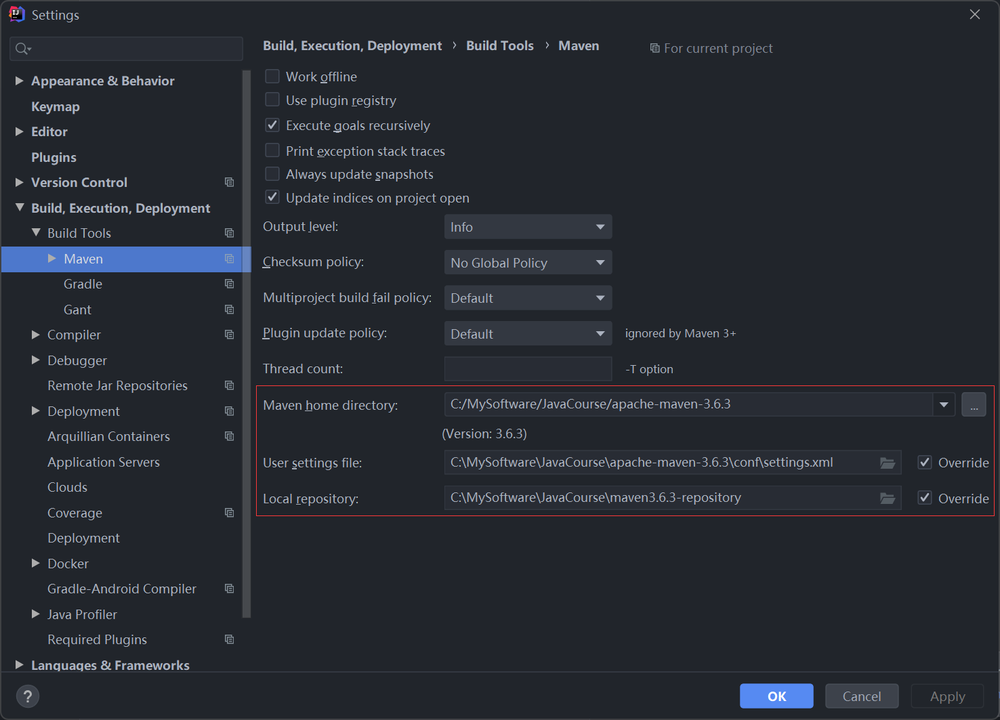
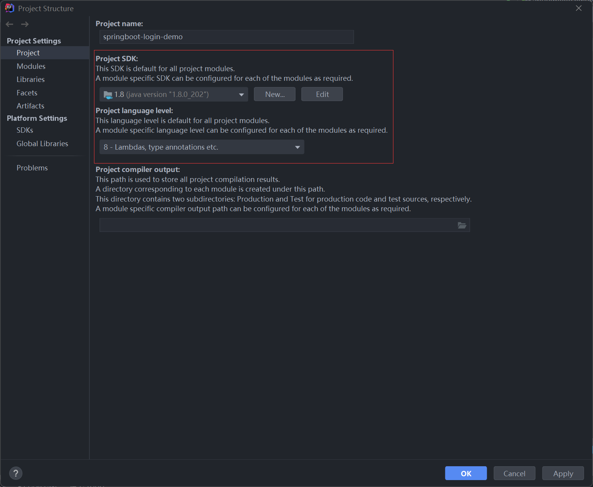
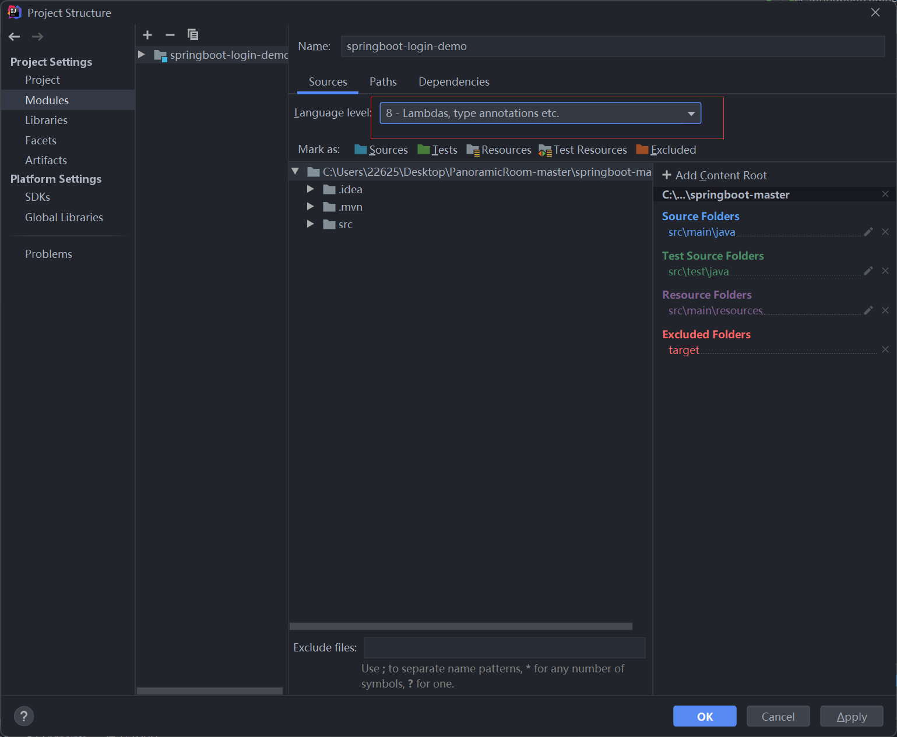
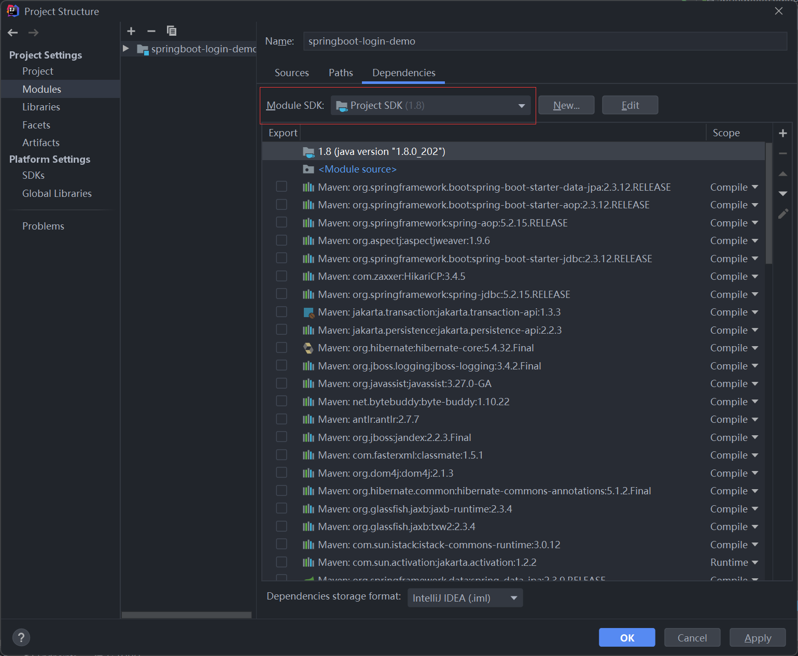
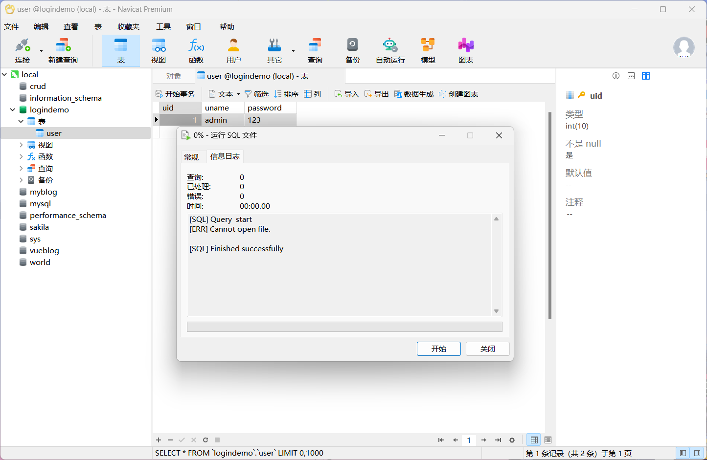
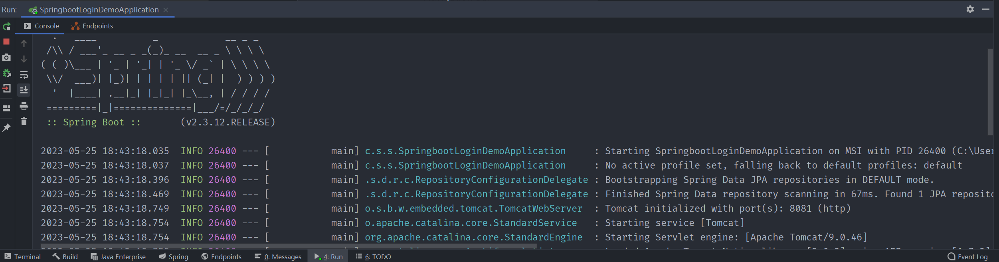

# PanoramicRoom

基于Unity3D WebGL的全景看房系统

# 后端

## 环境准备：

jkd1.8 

java8 

springboot2.3.12

MySQL

Maven

## 本地部署

**使用IDEA打开springboot-master文件夹：**

1. File—>Maven配置maven仓库



2. File->Project Structure设置jdk和java版本：







3. 运行SQL文件（.PanoramicRoom-master\SQL\logindemo.sql），这里使用Navicat软件：

注意将SQL配置成和本地相同（PanoramicRoom-master\springboot-master\src\main\resources\application.properties）

~~~
# 配置端口号
server.port=8081

# 配置数据库
spring.datasource.driver-class-name=com.mysql.cj.jdbc.Driver
spring.datasource.url=jdbc:mysql://localhost:3306/logindemo?serverTimezone=UTC

spring.datasource.username=root
spring.datasource.password=123456
~~~

运行成功：



5. 运行后端代码，至此后端运行成功

   


# 前端

## 环境准备

Node.js v10以上

## 本地部署

**使用VSCode打开vue-master文件夹，新建终端**

1. 安装项目依赖

```
npm install
```

2. 运行项目

```
npm run serve
```

3. 访问http://localhost:8080/注册登录

# Github

[liuke101/PanoramicRoom (github.com)](https://github.com/liuke101/PanoramicRoom)

# 云服务器部署

仅部署前端页面，用于测试移动端访问

[http://ftp6577789.host124.sanfengyun.cn](http://ftp6577789.host124.sanfengyun.cn/)

非私有域名，访问密码Whut1234


若提示移动设备不支持WebGL构建，忽略提示，等待加载完成即可。

